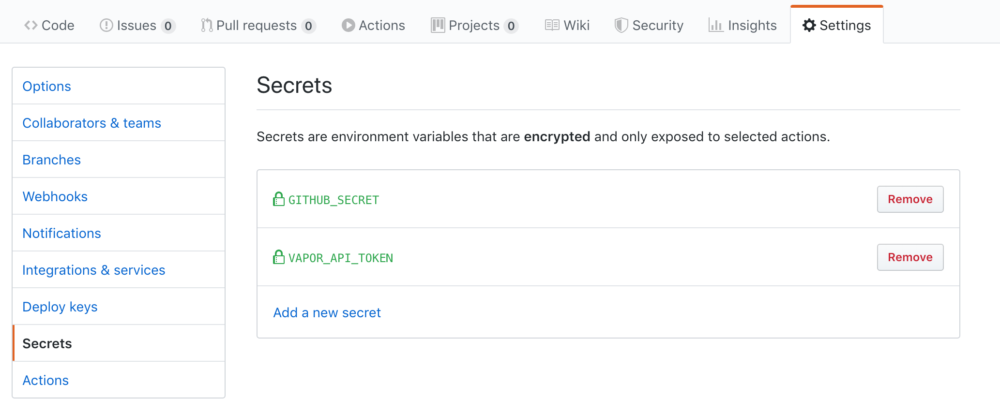

# Laravel Vapor Action

[![GitHub Release][ico-release]][link-github-release]
[![License][ico-license]](LICENSE)

GitHub Actions for [Laravel Vapor](https://docs.vapor.build/1.0/introduction.html#requirements). Base on Docker official [Composer](https://hub.docker.com/_/composer) image, and installed [hirak/prestissimo](https://github.com/hirak/prestissimo) and [laravel/vapor-cli](https://github.com/laravel/vapor-cli) package.

## Usage

Via GitHub Workflow

### Prepare
2. Generate a Vapor API Token under https://vapor.laravel.com/app/account/api-tokens
3. Add both as secret variables to your project under https://github.com/{username}/{project}/settings/secrets


## Private Github Repositories

The `GITHUB_SECRET` variable is used to access any private repos from your github profile.

Generate a Github Token under https://github.com/settings/tokens/new?scopes=repo&description=Github%20Action

**You need to define private repositories in your `composer.json` with the following URL format**

    "repositories": [
        {
            "type": "git",
            "url": "git@github.com:{username}/{project}.git"
        }
    ]

### Example Github Action

Add a new workflow under `.github/workflows` (e.g. `push.yaml`) to your repository to enable this Action.

You can find out more about under https://help.github.com/en/articles/workflow-syntax-for-github-actions#jobs

```
name: Deploy to staging
on:
  push:
    branches:
        - develop
jobs:
  vapor:
    runs-on: ubuntu-latest
    steps:
      - uses: actions/checkout@master
      - name: Deploy to staging
        env:
            VAPOR_API_TOKEN: ${{ secrets.VAPOR_API_TOKEN }}
            GITHUB_SECRET: ${{ secrets.GITHUB_SECRET }}
        uses: teamnovu/vapor-action@master
        with:
            args: deploy staging

```

## Credits

* [Oliver Kaufmann](https://github.com/okaufmann)

## License

The MIT License (MIT). Please see [License File](LICENSE) for more information.

[ico-release]: https://img.shields.io/github/tag/teamnovu/vapor-action.svg
[ico-license]: https://img.shields.io/badge/license-MIT-brightgreen.svg
[link-github-release]: https://github.com/teamnovu/vapor-action/releases
